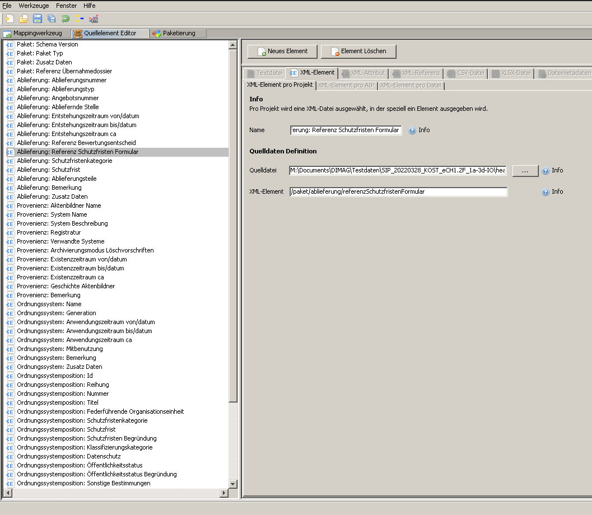

# Mapping

Kurze Beschreibung zum Inhalt dieses Ordners:

## Excel und CSV

In der Excel-Datei [ech0160.xlsm](./ech0160.xlsm) habe ich versucht, die Struktur des eCH-0160 XMLs resp. der XSD-Dateien aufzulisten. Die Idee war, dass der Pfad (xPath) relativ automatisch erstellt wird und nur der Name des Tag-Elements von Hand eingegben werden muss. Das Label wurde mit einer kleinen Macrofunktion automatisch aus dem Namen erstellt. Das nutzbare Ergebnis befindet sich im Reiter "ech0160-paket", das als CSV exportiert wird. Aus irgendeinem Grund konnte ich in meiner Excel-Version das Trennzeichen oder auch die Formatierung nicht angeben. Für die Weiterarbeit mit dem Shell-Script [prepare-ech0160-for-dimag.sh](./prepare-ech0160-for-dimag.sh) ist es wichtig, dass die Formatierung der CSV-Datei korrekt ist:

* Trennzeichen ist das Semikolon `;` und nicht das Komma.
* Codierung sollte `Unicode (UTF-8)` entsprechen.

## Shell Script und IPRF-Datei

Wenn oben aufgelistete Regeln eingehalten werden, kann die IPRF-Datei mittels Shell-Script generiert werden. Das Ergebnis befindet sich ebenfalls bereits in diesem Ordner: [AIP_20070923_KOST_eCH0160_1_1_GEVER.iprf](./AIP_20070923_KOST_eCH0160_1_1_GEVER.iprf).

## Problematik im Ingest Tool

Die Idee hinter dieser Vorangehensweise war, dass man relativ schnell ein IPRF für das Ingest-Tool erstellen kann, ohne das GUI zu benutzen und mehrfach (momentan sind es über 60 Felder) denselben Schritt im "Quellelement Editor" durchzuführen. Öffnet man oben erwähntes IPRF sollten die Elemente im Ingest Tool wie folgt aufgelistet werden:

Folgende Problematik sehe ich im jeweils angegebenen Pfad zur Quelldatei, der je nach SIP unterschiedlich ausfallen kann und je nach Anwender nicht korrekt ist. Man möchte ja ein generell gültiges Ingest Tool Config XML haben, das alle in der AV Dimag gleichermassen nutzen können. Dasselbe geschieht, wenn wir eine allgemeine IPRO-Datei definieren, die das Mapping enthält. In einem Ingest Tool Projekt wird jeweils der Pfad zur besagten IPRF-Datei angegeben und im XML abgelegt. Wenn aber jemand vom z.B. Kanton Aargau dieses IPRO nutzen möchte stimmt der Pfad zur IPRF-Datei natürlich nicht mehr. Man kann den Pfad zwar immer neu angeben, aber verändert dadurch immer die IPRO-XML. Lokal wahrscheinlich kein Problem.

## Stand der Dinge 

### 20.10.2022

Zur Zeit wird mit der IPRF-Datei lediglich die Hauptstruktur des SIPs abgebildet. Das heisst, nur jene Felder die eindeutig mit dem Ingest Tool ansteuerbar sind, sind im IPRF erfasst. Ich arbeite an einer Lösung, um auch die Daten der Dokumente auszulesen. Wir gehen davon aus, dass dafür im AIP ein zusätzliches XML benötigt wird, das lediglich die Dossier-Information mit den einzelnen, flach-strukturierten Dokumenten beinhaltet.

Die Problematik der verschachtelten Informationen betreffend Ordnungsystempositionen ist nach wie vor nicht gelöst. Es ist aber auch nicht zu 100% klar, ob DIMAG eine solche Verschachtelung abbilden kann oder, ob dies lediglich für das AIS von Interesse ist. Work in progress...

Es geht nun darum, dass das Ingest Tool die (manuell) erstellten AIP Metadaten ([metadata-dossier.xml](../testdaten/AIP_20070923_KOST_eCH0160_1_1_GEVER/22.06.12/metadata-dossier.xml) & [metadata-paket.xml](../testdaten/AIP_20070923_KOST_eCH0160_1_1_GEVER/22.06.12/metadata-paket.xml)) verarbeiten kann. Dazu fehlen aber noch die zusätzlichen Felder im IPRF.

